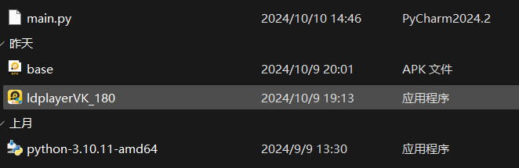
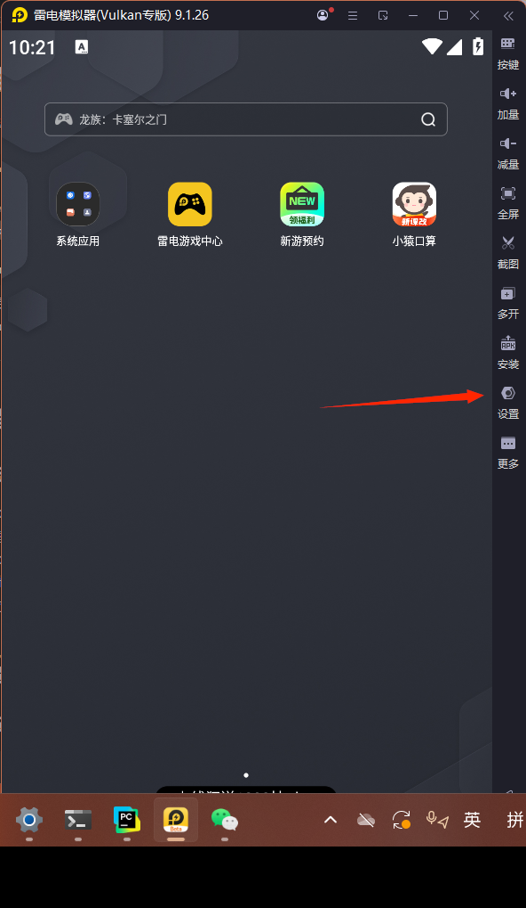
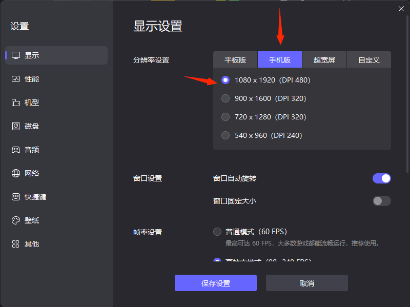
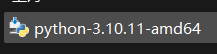
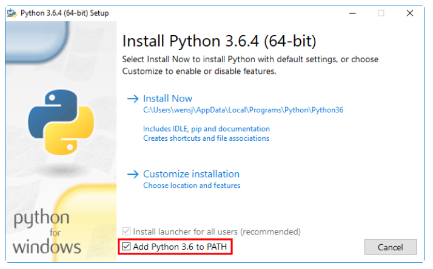
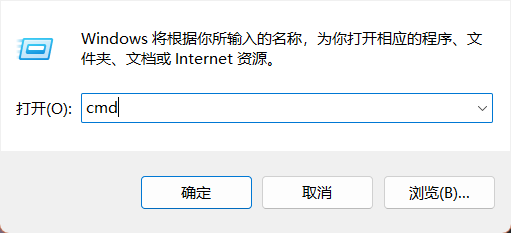
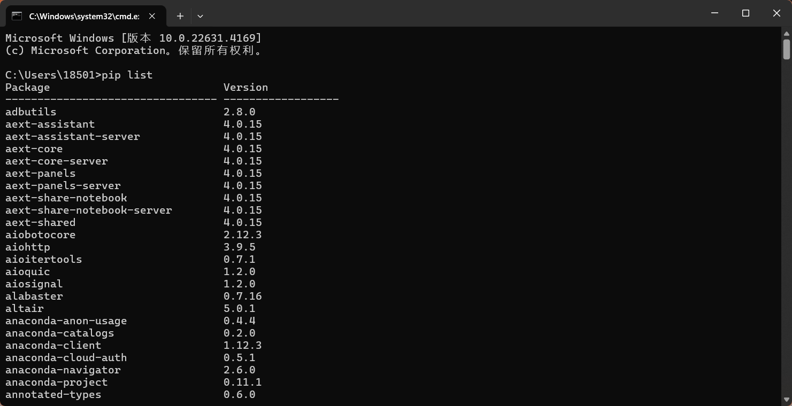
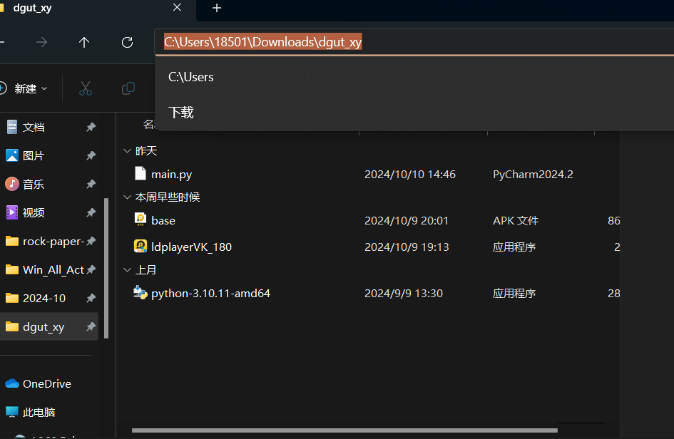

# 基于python的小猿口算脚本使用教程

---
## 1.准备事项
你将得到一个压缩包,解压后得到以下文件

依次是 脚本源代码 小猿口算安装包apk 雷电模拟器安装包 python
---
## 2.首先
### i.双击运行雷电模拟器安装包
 
 - q:为什么一定要是雷电呢  a:开发环境是雷电模拟器，其他模拟器不保证兼容
 - q:已经有了雷电模拟器,还要下载这个吗 a:建议是下载的,其他版不保证兼容,以及无法保证你是否在原有的模拟器上动过手脚(脚本只兼容最原始，最默认的设置)
### ii.一路绿灯安装完(假如不会安装,请加钱让技术人员,他们任你使唤)
### iii.安装完以后
(1)
点击设置

(2)调节分辨率

## 3.安装运行环境
(1)双击运行python安装包(建议安装我们给出的版本,其他版本兼容性不保证)

(2)勾选,然后

(3)按`win`+`r` 输入`cmd` 回车

(4)输入`pip list` 大概会有以下显示(不报错就行)

(5)输入`pip install uiautomator2 -i  https://pypi.tuna.tsinghua.edu.cn/simple` 等待安装完成

(6)双击运行main.py(如果不适用请看后面这种方法)

(7)或者在main.py的目录下(例,如图) 

(8)右键任意区域 选中`在终端中打开`,然后执行`python main.py`