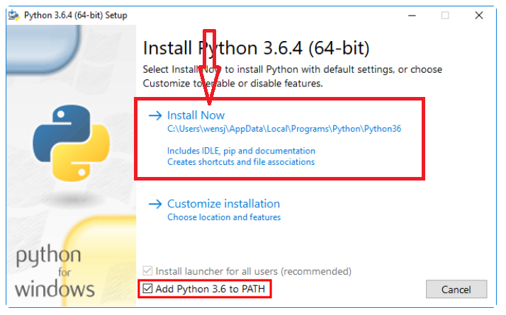

# 基于python的小猿口算脚本使用教程

---
## 1.准备事项
你将得到一个压缩包,解压后得到以下文件


依次是 脚本源代码 小猿口算安装包apk 雷电模拟器安装包 python

---
## 2.首先
### i.双击运行雷电模拟器安装包
 
 - q:为什么一定要是雷电呢  a:开发环境是雷电模拟器，其他模拟器不保证兼容
 - q:已经有了雷电模拟器,还要下载这个吗 a:建议是下载的,其他版不保证兼容,以及无法保证你是否在原有的模拟器上动过手脚(脚本只兼容最原始，最默认的设置)

### ii.一路绿灯安装完(假如不会安装,请加钱让技术人员帮你,他们任你差遣)
### iii.安装完以后

(1)点击设置


(2)调节分辨率


(3)安装小猿口算

将我们给你的文件夹中的base.apk文件拖入雷电模拟器，然后登录小猿，先手动pk几次(小猿一开始会随机弹一些广告)

## 3.安装运行环境

(1)双击运行python安装包(建议安装我们给出的版本,其他版本兼容性不保证)


(2)勾选,然后



(3)按`win`+`r` 输入`cmd` 回车


(4)输入`pip list` 大概会有以下显示(不报错就行)


(5)输入`pip install uiautomator2 -i  https://pypi.tuna.tsinghua.edu.cn/simple` 等待安装完成

(6)双击运行main.py(如果不适用请看后面这种方法)

(7)或者在main.py的目录下(例,如图) 


(8)右键任意区域 选中`在终端中打开`,然后执行`python main.py`

## 4.

```python
import uiautomator2 as u2
import time
de =u2.connect()


def sw_dayu():
    fx=261
    fy=1133
    tx=400
    ty=1281
    de.swipe(fx,fy,tx,ty,steps=1)
    fx=tx
    fy=ty
    tx=261
    ty=1420
    de.swipe(fx,fy,tx,ty,steps=1)
    time.sleep(0.35)   #这里设置题目与题目之间的间隔 如果出现卡住不动 请稍微调高一点

def sw_xiaoyu():
    fx = 639
    fy = 1253
    tx = 400
    ty = 1400
    de.swipe(fx, fy, tx, ty,steps=1)
    fy = 1500
    de.swipe(tx, ty, fx,fy ,steps=1)
    time.sleep(0.35)  #这里设置题目与题目之间的间隔

de(text="小猿口算").click()
de(index=5,className="android.view.ViewGroup").click()
de(text="开始PK").wait()


while True:
    
    print("开始PK")
    de(text="开始PK").click()
    print("已经开始")
    time.sleep(5)
    
    while True:
        try:
            e1 = de(className="android.widget.TextView",index=0)
            e2 = de(className="android.widget.TextView",index=2)
            if int(e1.get_text())>int(e2.get_text()):
                sw_dayu()
            else:
                sw_xiaoyu()
            ise = de(text="正在加载").exists()
            
            print(ise)
            if ise:
                time.sleep(3)
                
                
                de.press("back")
                de.press("back")
                time.sleep(5)
                print("重新开始")

                print("开始PK")
                
                de(text="开始PK").wait()
                
                de(text="开始PK").click()
                print("已经开始")
                time.sleep(5)
                
                
        finally:
            continue
    continue
```